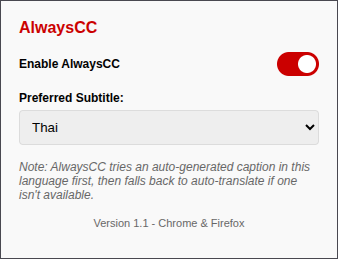

# AlwaysCC

<div align="center">


**Never miss a word on YouTube again - automatically enable captions on every video**

[](https://opensource.org/licenses/MIT)

</div>

## Overview

AlwaysCC is a Chrome/Firefox extension that automatically enables closed captions on YouTube videos and lets you choose your preferred subtitle language or translation. No more manually clicking the CC button every time!

## Features

- **Auto-Enable**: Automatically turns on captions when you watch YouTube videos
- **On/Off Switch**: Toggle auto-enable behavior on or off at any time
- **Language Selection**: Choose your preferred subtitle language
- **Auto-Translation**: Select "auto-translate" to any supported language
- **Seamless Experience**: Works behind the scenes without disrupting your viewing

## Installation

### Chrome (Manual Installation)

The extension is not yet published on the Chrome Web Store. To install it manually:

1. Download this repository (`git clone https://github.com/GarFiwld/AlwaysCC.git` or download ZIP)
2. Open Chrome and go to `chrome://extensions`
3. Enable "Developer mode" (toggle in the top right)
4. Click "Load unpacked"
5. Select the extension folder (the one containing `manifest.json`)

### Firefox (Manual Installation)

If you prefer to install manually:

1. Download this repository (`git clone https://github.com/GarFiwld/AlwaysCC.git` or download ZIP)
2. Open Firefox and go to `about:debugging`
3. Click "This Firefox"
4. Click "Load Temporary Add-on..."
5. Select any file from the extension folder

### Development Installation (with signature bypass)

Firefox requires extensions to be signed, but for development you can bypass this:

1. In Firefox, type `about:config` in the address bar
2. Accept the warning
3. Search for `xpinstall.signatures.required`
4. Double-click to toggle its value to `false`
5. Restart Firefox
6. Install the extension by opening the .xpi file directly

This method only works in Firefox Developer Edition, Firefox Nightly, or Firefox ESR.

## Usage

1. After installation, click the AlwaysCC icon in your browser toolbar
2. Use the toggle switch to turn auto-enable on or off
3. Choose your preferred subtitle language from the dropdown menu — it saves automatically as soon as you select it
4. That's it! AlwaysCC will now automatically enable your preferred subtitles on all YouTube videos



## How It Works

When the toggle is on, AlwaysCC monitors YouTube pages and:
1. Detects when a video is loaded
2. Checks if captions are already enabled
3. Enables captions if needed
4. Navigates YouTube's menu system to select your preferred subtitle option
5. Handles auto-translate selection when needed

Turning the toggle off disables the auto-enable behavior; your preferred subtitle language stays saved and selectable in the popup regardless of the toggle state.

The extension is designed to be lightweight and only activates on YouTube pages.

## Development

### Prerequisites

- Chrome or Firefox browser
- Basic knowledge of JavaScript, HTML, and CSS

### Setup

1. Clone the repository:
   ```
   git clone https://github.com/GarFiwld/AlwaysCC.git
   ```

2. Make your changes to the code

3. Test the extension:
   - **Chrome**: go to `chrome://extensions`, enable "Developer mode", click "Load unpacked", and select the extension folder
   - **Firefox**: go to `about:debugging`, click "This Firefox", click "Load Temporary Add-on...", and select any file from the extension folder

4. Package the extension:
   - Run the included `package.ps1` script
   - A single `alwayscc.zip` will be created in the `build` directory, installable on both Chrome Web Store and Firefox AMO

### Project Structure

- `manifest.json` - Extension configuration
- `content.js` - Core functionality that runs on YouTube pages
- `popup.html` & `popup.js` - User interface for settings
- `icons/` - Extension icons
- `package.bat` - Packaging script

## Contributing

Contributions are welcome! Please feel free to submit a Pull Request.

1. Fork the repository
2. Create your feature branch (`git checkout -b feature/amazing-feature`)
3. Commit your changes (`git commit -m 'Add some amazing feature'`)
4. Push to the branch (`git push origin feature/amazing-feature`)
5. Open a Pull Request

## License

This project is licensed under the MIT License - see the [LICENSE](LICENSE) file for details.

## Acknowledgments

- This project is a fork of [AlwaysCC](https://github.com/oop7/AlwaysCC.git) by [oop7](https://github.com/oop7) — all credit for the original idea and implementation goes to them
- Thanks to all contributors and users of AlwaysCC
- Built with love for the hearing-impaired community and language learners

---